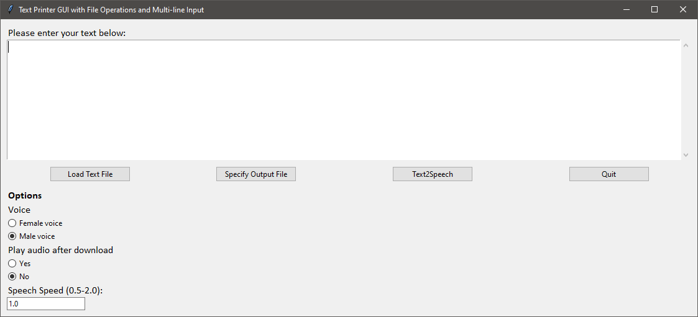

# TalkingVid_AI

TalkingVid_AI is a GUI realized using Python and Tkinter. It uses the OpenAI Python API and the OpenAI tts1-model to convert ASCII text to a mp3 audio file.

## Important prerequisite

To use TalkingVid_AI, you need an OpenAI account ([https://openai.com/](https://openai.com/)).

Once you have set up an account, you will need the OpenAI API key. This is a 52-character alphanumeric string. It is a unique identifier that allows developers to access OpenAI models via the API. You can generate the key in your profile settings ([OpenAI Platform](https://platform.openai.com/api-keys)).

On Windows, this key needs to be added to the system variables. Here's how to do it:

- Right-click on 'This PC' or 'My Computer' and select 'Properties'.

- Click on 'Advanced system settings'.

- Click the 'Environment Variables' button.

- In the 'System variables' section, click 'New...' and enter OPENAI_API_KEY as the variable name and your API key as the variable value.

- To verify the setup, open the command prompt and type the following command. It should display your API key.:

    `echo %OPENAI_API_KEY%`

    
Initially, you have a small credit balance in your account and can use the TalkingVid_AI application and the tts-1 model it is using. After this starting credit is used up, you can top it up in the profile settings under the Billing category ([https://platform.openai.com/settings/organization/billing/overview](https://platform.openai.com/settings/organization/billing/overview)). The minimum deposit is $5 and can be paid by credit card.

## How to use the application

TalkingVid_AI is Python Tkinter Widget.

 
 
At the top of the widget, there is a text input field. Here, you can type or paste the text that you want to convert into an MP3 file.

### Controls

Below the text input window, there are four buttons, whose functions will be explained below.

**Load Text File**

The first button, labeled "Load Text File," allows you to load a text file containing ASCII text (*.txt). The contents of the text file will be displayed in the text input window.

**Set Output File**

The second button is used to set the filename for the mp3 file to be generated. Based on this filename, a corresponding file name with the extension .txt is internally created. In this file, the entered text is saved alongside the mp3 file.

**Text2Speech**

After specifying the text to be voiced and the name of the output file, this button initiates the conversion of the text into an audio file. Once the operation is completed, a small notification appears on the screen indicating that the operation is complete and the file has been saved.

**Quit**

This button closes the application.

### Options

**Voice**
Here you can switch between a female and a male voice.

**Speed (0.5-2.0)**
This option allows you to set the voice speed. Default value is 1.0

